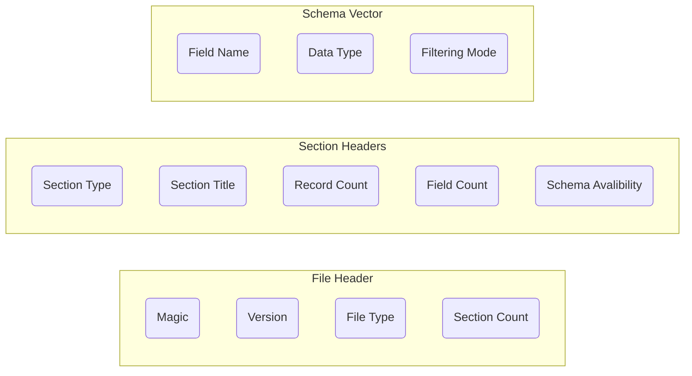

```mermaid 

flowchart LR
    subgraph File Header
    a1(Magic)
    a2(Version)
    a3(File Type)
    a4(Section Count)
    end

    subgraph Section Headers
    b1(Section Type)
    b2(Section Title)
    b3(Record Count)
    b4(Field Count)
    b5(Schema Avalibility)
    end

    subgraph Schema Vector
    c1(Field Name)
    c2(Data Type)
    c3(Filtering Mode)
    end


```