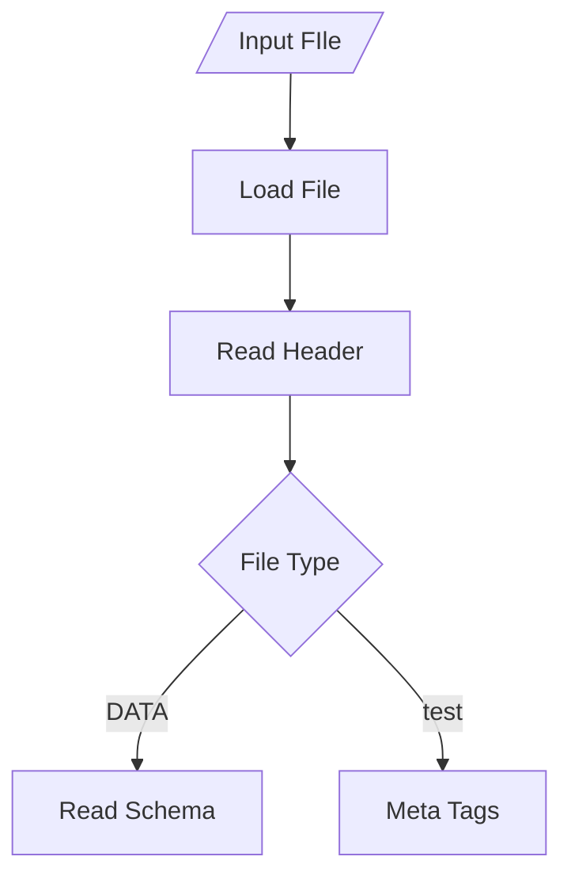

### Logical process for parsing files

---

```mermaid

flowchart TB
id1[/Input FIle/] --> id2[Load File]
id2 --> id3[Read Header]

id3 --> id4{File Type}

id4 --> |DATA| id5[Read Schema]
id4 --> |test| id6[Meta Tags]


```