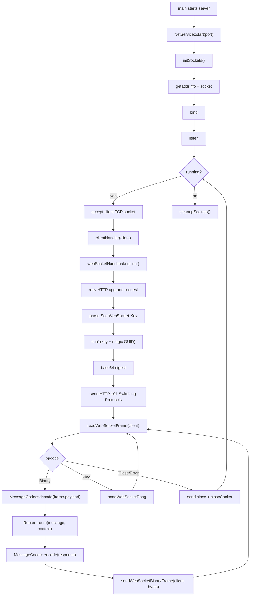

```mermaid
flowchart TD
    A["main starts server"] --> B["NetService::start(port)"]
    B --> C["initSockets()"]
    C --> D["getaddrinfo + socket"]
    D --> E["bind"]
    E --> F["listen"]
    F --> G{"running?"}
    G -->|yes| H["accept client TCP socket"]
    H --> I["clientHandler(client)"]
    I --> J["webSocketHandshake(client)"]
    J --> K["recv HTTP upgrade request"]
    K --> L["parse Sec-WebSocket-Key"]
    L --> M["sha1(key + magic GUID)"]
    M --> N["base64 digest"]
    N --> O["send HTTP 101 Switching Protocols"]
    O --> P["readWebSocketFrame(client)"]
    P --> Q{"opcode"}
    Q -->|Binary| R["MessageCodec::decode(frame.payload)"]
    R --> S["Router::route(message, context)"]
    S --> T["MessageCodec::encode(response)"]
    T --> U["sendWebSocketBinaryFrame(client, bytes)"]
    U --> P
    Q -->|Ping| V["sendWebSocketPong"]
    V --> P
    Q -->|Close/Error| W["send close + closeSocket"]
    W --> G
    G -->|no| X["cleanupSockets()"]
```